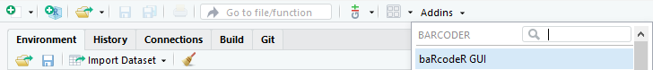
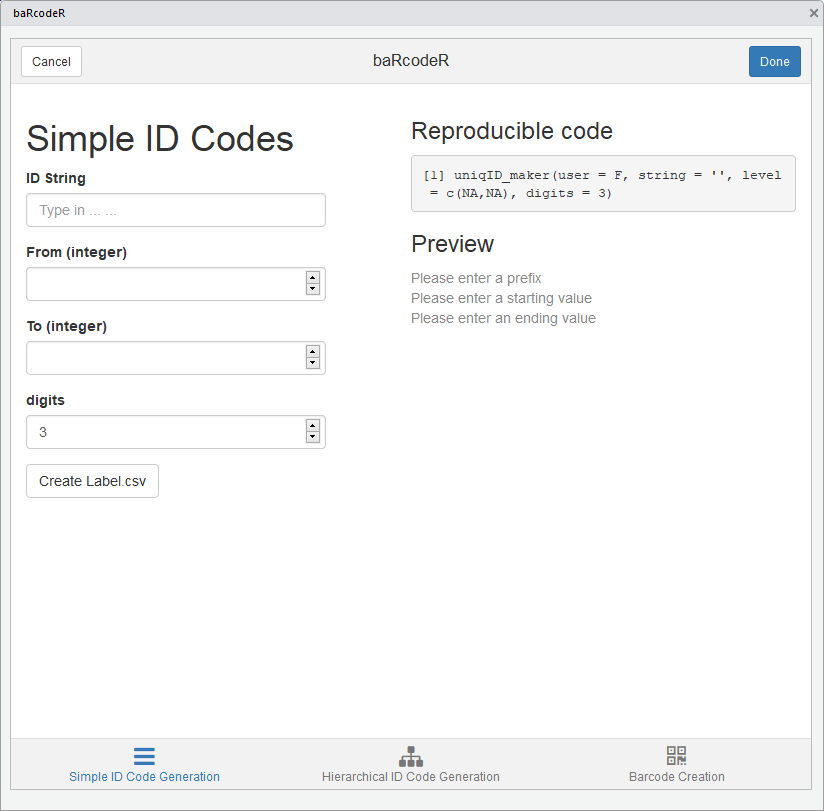
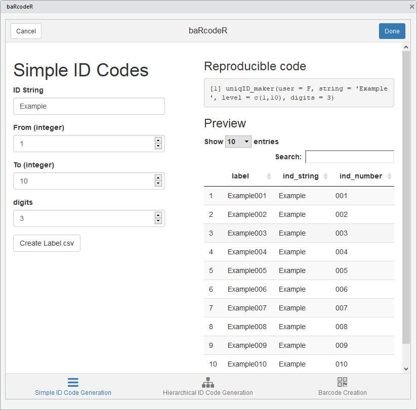
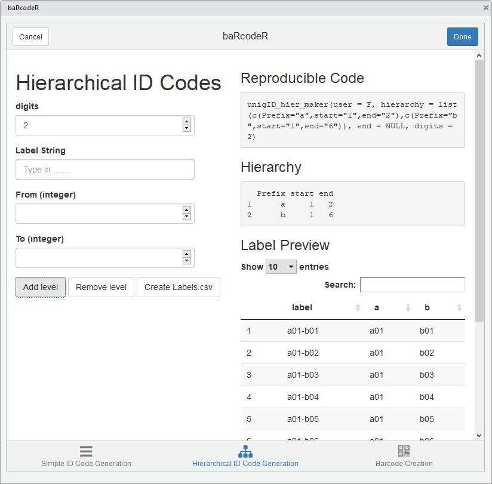
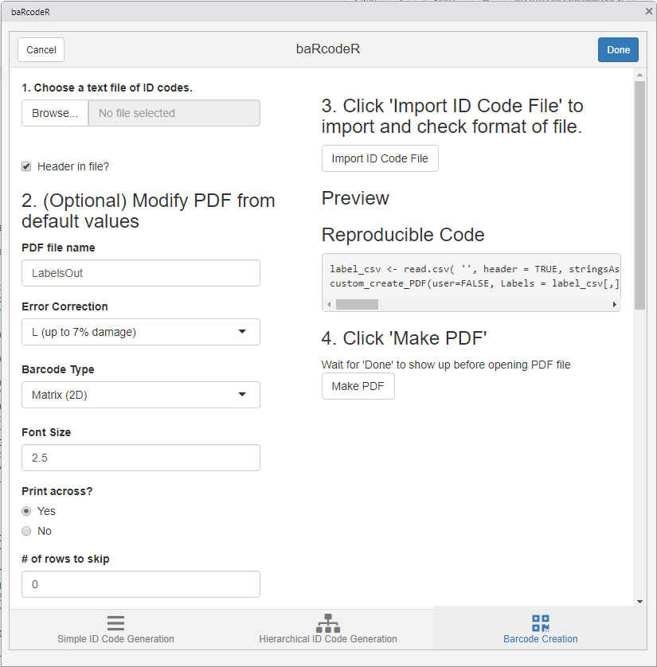
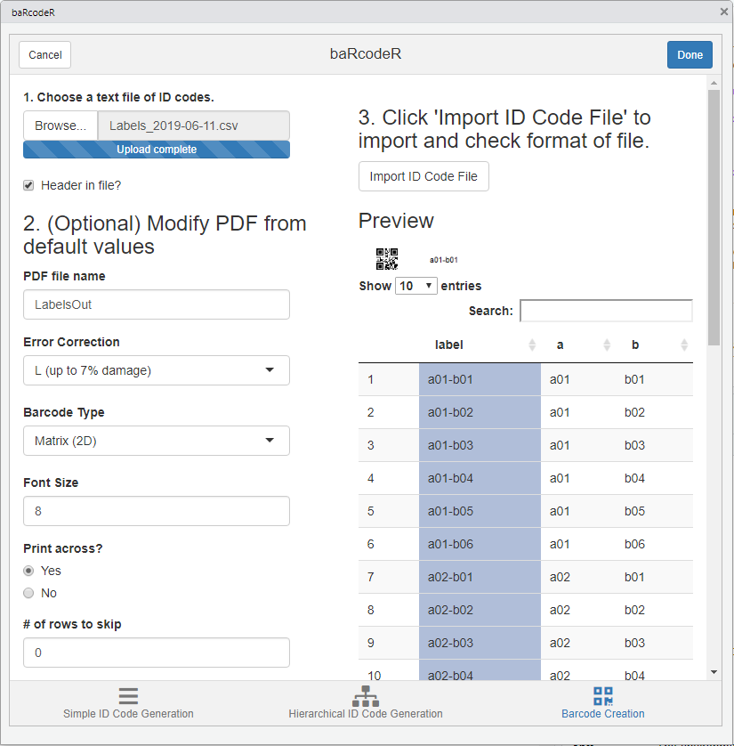

# Use baRcodeR addin

``` r

knitr::opts_chunk$set(echo = F)
```

BaRcodeR is an open-source program to facilitate repeatable label
generation and management for labelling, tracking and curating data from
biological samples.

Flowchart of major functions


For a quick start, see the
[introduction](https://docs.ropensci.org/baRcodeR/).

## Cheat Sheet

A 2-page, quick-reference guide is available via
[Figshare](https://dx.doi.org/10.6084/m9.figshare.7043309)

If RStudio is not available, see the
[introduction](https://docs.ropensci.org/baRcodeR/) and
`vignette("Using-baRcodeR)"` for command line use.

### Using the RStudio addin

The main baRcodeR functions for unique identifiers and QR code
generation can be performed interactive via the RStudio addin found on
the toolbar.

#### Find the addin

Make sure to restart RStudio after installing. Then the addin should
appear in the toolbar.

Click on the add-in, and a popup window will appear.



Screenshot of RStudio addins bar

Note the 3 tabs along the bottom, corresponding to the three main
baRcodeR commands: `uniqID_maker`, `uniqID_hier_maker` and `create_PDF`.



Screenshot of the simple ID Code tab

#### Generate simple ID codes

The first tab generates basic ID codes with user input as seen below:



Active simple ID code tab

As you fill in the fields, a preview of the ID codes will appear on the
right-hand side along with reproducible code, which can be copied for
archival purposes. Clicking ‘Create Label.csv’ will create a CSV file
called ‘Label_YYYY-MM-DD.csv’, which contains a data frame with the full
unique ID strings as the first column, the user-defined prefix string in
the second column, and the unique ID number in the third column. This
file is useful for archiving ID codes and as a starting point for data
entry. For example, it can be opened in a spreadsheet program to add
data measurement columns. It is also the input for creating printable,
QR-coded labels with `create_PDF`.



Screenshot of the hierarchical ID code tab

#### Generate Hierarchical ID codes

You can switch from the simple ID code generation tab to the
hierarchical ID code generation or QR code creation tabs at the bottom.

Hierarchical ID codes have a nested structure (e.g. X subsamples from Y
individuals at Z time points), the information for each level is saved
under the “Hierarchy” section. The “Add level” button is used to add
more levels to the hierarchy, and the “Remove level” button will remove
the most recently added level. The data frame output will contain ID
codes in the first column, and a separate column for each level of the
hierarchy, with the user-defined string as the header; as shown under
‘Preview’. As with the simple ID code tab, the output of Hierarchical ID
codes is a CSV file “Labels_YYYY-MM-DD.csv”, saved in the working
directory. This file is useful for archiving ID codes and as a starting
point for data entry. For example, it can be opened in a spreadsheet
program to add data measurement columns. It is also the input for
creating printable, QR-coded labels with `create_PDF`.



Sceenshot of PDF creation tab

#### Create the PDF for sticker printing

The Barcode Creation tab contains all the advanced options for page
layout. The default options fit a specific format: ULINE 1.75” \* 0.5”
WEATHER RESISTANT LABEL for laser printer; item \# S-19297 (uline.ca). A
text file containing ID codes is imported by clicking the “Browse”
button and selecting the CSV text file in the file browser. The file is
be previewed by clicking “Import File”.

After importing a CSV file, the preview shows part of the expected
output PDF file based on font size and other layout options. The first
column is highlighted by default and defines the column to use for the
labels. Clicking on a different column will set it as the ID code
column, as shown in the preview.



Screenshot of Column Selection

Clicking “Make PDF” will generate a printable PDF of all barcodes
provided. This can take several minutes for \>100 barcodes, depending on
computer speed. The text “Done” will appear upon completion of the PDF
file.

> NOTE: When printing from pdf, ensure that ‘anti-aliasing’ or
> ‘smoothing’ options are turned OFF, and that you are not using ‘fit to
> page’ or similar options that will re-scale the output.

    ## R version 4.6.0 (2026-04-24)
    ## Platform: x86_64-pc-linux-gnu
    ## Running under: Ubuntu 24.04.4 LTS
    ## 
    ## Matrix products: default
    ## BLAS:   /usr/lib/x86_64-linux-gnu/openblas-pthread/libblas.so.3 
    ## LAPACK: /usr/lib/x86_64-linux-gnu/openblas-pthread/libopenblasp-r0.3.26.so;  LAPACK version 3.12.0
    ## 
    ## locale:
    ##  [1] LC_CTYPE=en_US.UTF-8       LC_NUMERIC=C              
    ##  [3] LC_TIME=en_US.UTF-8        LC_COLLATE=en_US.UTF-8    
    ##  [5] LC_MONETARY=en_US.UTF-8    LC_MESSAGES=en_US.UTF-8   
    ##  [7] LC_PAPER=en_US.UTF-8       LC_NAME=C                 
    ##  [9] LC_ADDRESS=C               LC_TELEPHONE=C            
    ## [11] LC_MEASUREMENT=en_US.UTF-8 LC_IDENTIFICATION=C       
    ## 
    ## time zone: Etc/UTC
    ## tzcode source: system (glibc)
    ## 
    ## attached base packages:
    ## [1] stats     graphics  grDevices utils     datasets  methods   base     
    ## 
    ## loaded via a namespace (and not attached):
    ##  [1] digest_0.6.39     desc_1.4.3        R6_2.6.1          fastmap_1.2.0    
    ##  [5] xfun_0.60         cachem_1.1.0      knitr_1.51        htmltools_0.5.9  
    ##  [9] png_0.1-9         rmarkdown_2.31    lifecycle_1.0.5   cli_3.6.6        
    ## [13] sass_0.4.10       pkgdown_2.2.1     textshaping_1.0.5 jquerylib_0.1.4  
    ## [17] systemfonts_1.3.2 compiler_4.6.0    tools_4.6.0       ragg_1.5.2       
    ## [21] bslib_0.12.0      evaluate_1.0.5    yaml_2.3.12       otel_0.2.0       
    ## [25] jsonlite_2.0.0    rlang_1.3.0       fs_2.1.0          htmlwidgets_1.6.4
